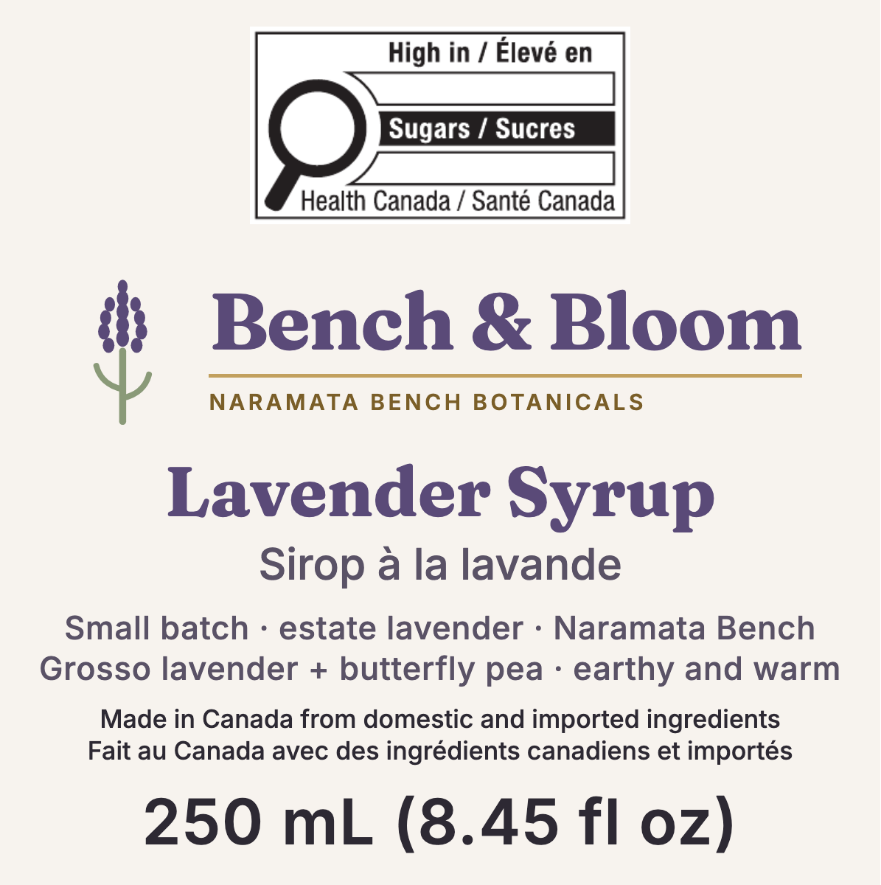

| | |
|---|---|
| **Document** | JATEL_LabelGenSpec_v1.0_20261003 |
| **Date** | 2026-10-03 (Pacific) |
| **Prepared by** | Nelson Jatel, Bench & Bloom, with Claude Code |
| **Product** | Bench & Bloom Lavender Syrup / Sirop à la lavande, 250 mL |
| **Market** | Canada (Amazon.ca and direct). No US variant in this version |
| **Supersedes** | All July 2026 label artwork (1:5 refrigerated formulation). See §10, "Do not use" |
| **Source of record** | `JATEL_ProductSpec_v1.0_20260906.md`, `singlelabel/Label_PrinterSpec_Wrap_uline2026.md` v2.0, `JATEL_LabelRedesign_v1.0_20260908.md`, repo commit `5b5134d` |

# 0. How to use this document

This document is written to be handed to an AI image or layout generator (or a human designer) as the **complete and only input** for drawing the label. Everything needed is here: the bottle, the geometry, every word of copy in English and French, the type, the colours, the assets, the regulatory constraints, and the tests the output must pass. Appendix A repeats the essentials as machine-readable JSON.

**Rules for the generator. Read these first.**

1. **Use copy verbatim.** Every string in §5 to §8 is final wording (French pending professional verification). Do not paraphrase, shorten, translate, correct or "improve" it.
2. **Never invent.** No new claims, badges, certifications, awards, nutrient values, dates, lot numbers, addresses, URLs or ingredients. If something seems missing, leave a clearly marked placeholder and report it.
3. **Do not draw regulated artwork.** The "High in sugars" symbol, the UPC barcode and the QR code are placed from supplied files or generated by the specified tool, never drawn or re-typed.
4. **Work in millimetres, vector.** Output SVG (and PDF) at final size, 1 unit = 1 mm, with the layers listed in §12.4.
5. **Respect every minimum** in §3, §4.2, §5 and §7 (type heights, symbol size, barcode magnification, QR size, safe margin). A minimum is a floor, not a target.
6. **Run the acceptance tests in §14** and report PASS / FLAG for each. A label that fails any Critical test is not finished.
7. Items marked **[VERIFY]** are best current answers awaiting confirmation (CFIA, a refractometer, a translator). Build to them as written and list them in your output report.

# 1. The product (data of record)

| Field | Value |
|---|---|
| Brand | **Bench & Bloom** |
| House line / descriptor | **NARAMATA BENCH BOTANICALS** |
| Common name (mandatory, bilingual) | **Lavender Syrup / Sirop à la lavande** |
| Net quantity | **250 mL (8.45 fl oz)** |
| Formulation | 11 : 5 sugar : water by volume, acidified with citric acid, hot-filled |
| Sugar concentration | 64 °Brix (recipe-calculated; refractometer reading pending, §15) |
| pH | stated as ≤ 3.5 (estimate 2.34; colour indicator brackets ≤ 3.0) |
| Shelf stability | **Ambient shelf-stable.** Refrigerate after opening |
| Colour in bottle | **Deep ruby to garnet red**, clear, viscous. Not blue |
| Flavour | Lavender (Grosso), bright citric lift, sweet |
| Lavender | *Lavandula* ×*intermedia* 'Grosso', grown on the farm, Naramata Bench, BC |
| Made at | 3820 Partridge Rd, Naramata, BC, Canada V0H 1N1 |
| GTIN (UPC-A) | **627146286305** (GS1 Canada) |
| Website / email | benchandbloom.com · hello@benchandbloom.com |

# 2. The bottle the label is applied to

The label is designed for one container only. Do not adapt it to another bottle without redoing §3.

| Property | Value | Source |
|---|---|---|
| Supplier and item | **Uline S-23397**, 8 oz Clear Boston Round, glass | Uline Canada product page; verified in hand, order 53425173, 48 EA received 2026-06-23 |
| Nominal capacity | 8 oz (≈ 237 mL) nominal; filled with **250 mL** | Uline; fill per product spec |
| Overall height | **5.437 in (138.1 mm)**, cap on | Uline |
| Body diameter | **2.375 in (60.3 mm)** | Uline |
| Circumference | **7.461 in (189.5 mm)** | π × 60.3 mm |
| Straight (labellable) body panel | **3.125 in (79.4 mm)** tall | Uline |
| Shape | Boston round: cylindrical through the full label panel, rounded shoulder, narrow neck | Physical bottle |
| Neck finish | **28-400** | Uline |
| Cap | Included with S-23397, shipped attached | Uline listing; order 53425173 |
| Empty weight | **209 g** with cap (Uline unit weight 0.46 lb) | Uline listing |
| Filled weight | **≈ 540 g** (209 g bottle + 329 g syrup + ~2 g label) | Box packaging spec, 2026-09-06 |
| Tamper band | **Uline S-17668** black PVC shrink band, **55 × 28 mm**, over cap and neck, sits **above** the label | Printer spec v2.0 |
| Glass | Clear (flint). The ruby syrup is visible through the rear window and above and below the label | |

**Fit check [VERIFY].** A nominal 8 oz Boston round holding 250 mL is filled close to the neck. Before printing, fill one bottle with exactly 250 mL of hot syrup, let it cool, and confirm the fill line sits above the label's top edge and below the band.

# 3. Label geometry

## 3.1 Overall

| Dimension | Inches | Millimetres |
|---|---|---|
| **Trim (finished, die-cut) size** | **7.25 × 2.75** | **184.15 × 69.85** |
| Bleed, all four sides | 0.125 | 3.175 |
| Artwork / document size including bleed | 7.50 × 3.00 | 190.50 × 76.20 |
| Safe margin inside trim, all four sides | 0.125 | 3.175 |
| Live (safe) area | 7.00 × 2.50 | 177.80 × 63.50 |
| Corner radius | none specified (square cut) [VERIFY with printer] | |

**Wrap math.** The 184.15 mm label on a 189.5 mm circumference leaves a **≈ 5.3 mm (0.21 in) vertical strip of bare glass** at the back where the two ends approach. This is intentional: the ends never have to meet or overlap, so hand application is forgiving, and the ruby syrup shows through.

**Vertical placement.** The 69.85 mm label centres in the 79.4 mm straight panel, leaving ≈ 4.8 mm (0.19 in) clear above and below. The shrink band stays above the label.

## 3.2 Coordinate system and panels

Origin (0, 0) = **top-left corner of the trim**. x increases right, y increases down, units mm. Bleed extends to x = −3.175 and y = −3.175.

| Panel | x from | x to | Width | Usable (inside safe) | Faces |
|---|---|---|---|---|---|
| **Left wing** | 0.00 | 60.50 | 60.50 | x 3.175 to 59.00 (55.8 mm), y 3.175 to 66.675 | Wraps to the back, left of the seam |
| **Front panel (PDP)** | 60.50 | 123.70 | 63.20 | x 60.50 to 123.70, y 3.175 to 66.675 (63.2 × 63.5) | Front of the bottle |
| **Right wing** | 123.70 | 184.15 | 60.45 | x 125.20 to 180.975 (55.8 mm), y 3.175 to 66.675 | Wraps to the back, right of the seam |

Keep a **1.5 mm gutter** on the wing side of each front/wing boundary (x 59.00 to 60.50 and x 123.70 to 125.20). Two thin **Bench Gold** vertical rules (0.3 mm, `#C2A05E`, full live height) may mark the front-panel boundaries at x = 60.50 and x = 123.70; they are decorative and optional.

**Usable wing area = 55.8 × 63.5 ≈ 3,543 mm² each.** (Earlier documents used 60.5 × 63.5 = 3,841 mm², which ignored the safe margin at the rear seam and the gutter. Use 3,543.)

<div class="fig">
<svg viewBox="-6 -10 200 92" xmlns="http://www.w3.org/2000/svg" font-family="Helvetica, Arial, sans-serif">
<rect x="-3.175" y="-3.175" width="190.5" height="76.2" fill="#fff" stroke="#c08" stroke-width="0.3" stroke-dasharray="1.5 1"/>
<rect x="0" y="0" width="184.15" height="69.85" fill="#F7F3EE" stroke="#2D2933" stroke-width="0.4"/>
<rect x="3.175" y="3.175" width="177.8" height="63.5" fill="none" stroke="#0aa" stroke-width="0.3" stroke-dasharray="1.5 1"/>
<line x1="60.5" y1="0" x2="60.5" y2="69.85" stroke="#C2A05E" stroke-width="0.6"/>
<line x1="123.7" y1="0" x2="123.7" y2="69.85" stroke="#C2A05E" stroke-width="0.6"/>
<text x="31" y="20" font-size="4" text-anchor="middle" fill="#2D2933">LEFT WING</text>
<text x="31" y="26" font-size="2.6" text-anchor="middle" fill="#5A5266">coding panel · dealer · UPC</text>
<text x="31" y="30" font-size="2.6" text-anchor="middle" fill="#5A5266">QR · storage · clean-label</text>
<text x="92.1" y="20" font-size="4" text-anchor="middle" fill="#2D2933">FRONT (PDP)</text>
<text x="92.1" y="26" font-size="2.6" text-anchor="middle" fill="#5A5266">sugars symbol (upper half)</text>
<text x="92.1" y="30" font-size="2.6" text-anchor="middle" fill="#5A5266">lockup · name · origin · net qty</text>
<text x="153.9" y="20" font-size="4" text-anchor="middle" fill="#2D2933">RIGHT WING</text>
<text x="153.9" y="26" font-size="2.6" text-anchor="middle" fill="#5A5266">Nutrition Facts</text>
<text x="153.9" y="30" font-size="2.6" text-anchor="middle" fill="#5A5266">ingredients EN/FR</text>
<text x="0" y="-5" font-size="2.6" fill="#2D2933">x 0</text>
<text x="56" y="-5" font-size="2.6" fill="#2D2933">60.5</text>
<text x="119" y="-5" font-size="2.6" fill="#2D2933">123.7</text>
<text x="176" y="-5" font-size="2.6" fill="#2D2933">184.15</text>
<text x="0" y="78" font-size="2.6" fill="#c08">magenta = bleed edge (190.5 × 76.2)</text>
<text x="70" y="78" font-size="2.6" fill="#2D2933">black = trim (184.15 × 69.85)</text>
<text x="132" y="78" font-size="2.6" fill="#0aa">cyan = safe (177.8 × 63.5)</text>
<text x="-5" y="40" font-size="2.6" fill="#5A5266" transform="rotate(-90 -5 40)">rear seam</text>
<text x="189" y="30" font-size="2.6" fill="#5A5266" transform="rotate(90 189 30)">rear seam</text>
</svg>
<p class="cap">Figure 1. Flat layout at trim size (mm). The two outer ends meet at the back of the bottle with a ≈ 5.3 mm bare-glass gap.</p>
</div>

# 4. Typography and colour

## 4.1 Fonts

| Use | Family | Weight | Licence / file |
|---|---|---|---|
| Wordmark "Bench & Bloom", English common name "Lavender Syrup" | **Fraunces** | 700 | SIL OFL; `node_modules/@fontsource/fraunces` |
| Everything else | **Inter** | 500 regular text, 600 emphasis, 700 Nutrition Facts headings | SIL OFL; `node_modules/@fontsource/inter` |

**Outline all type before print** (or embed the fonts). If Fraunces is missing, the renderer falls back to Georgia, which is wrong: embed both families.

**Type-size measures used in this document.** Inter cap / numeral height = 0.727 × font size. Inter x-height (lowercase "o") ≈ 0.55 × font size. Fraunces x-height ≈ 0.50 × font size [Moderate confidence: font metrics, re-measure on the outlined art].

## 4.2 Minimum type heights

| Text | Minimum | Measured on | Font size that meets it (Inter) |
|---|---|---|---|
| Net quantity numerals (PDS > 32 to ≤ 258 cm²) | **3.2 mm** | numeral height | ≥ **4.5 mm** (gives 3.27 mm) |
| All other **mandatory** text (common name, ingredients, storage, dealer, best-before field names) | **1.6 mm** [VERIFY, Moderate confidence] | lowercase "o" (x-height) | ≥ **2.95 mm (8.4 pt)** |
| Nutrition Facts table | Per the Health Canada format chosen (§8.1) | as specified by the format | as specified |
| Voluntary text (tasting line, clean-label line, origin claim) | no legal minimum; keep ≥ 1.8 mm font for legibility | | ≥ 1.8 mm |

**The 1.6 mm rule is the single biggest space driver on the wings.** It is CFIA's general legibility minimum for mandatory information on a container with an available display surface over 10 cm² (this label is ≈ 128 cm²). The July 2026 artwork set its back copy at 4.4 to 4.6 pt (x-height ≈ 0.9 mm), which would fail. Confirm with AskCFIA; until then, build to 1.6 mm.

## 4.3 Colour palette

Ground is full-bleed Chalk White. CMYK values are the print values; spot Pantone 5275 C may replace Lavender Deep if the printer offers spot colour.

| Role | Name | HEX | CMYK | Use |
|---|---|---|---|---|
| Ground | Chalk White | `#F7F3EE` | 0 / 2 / 4 / 3 | Full-bleed background |
| Wordmark, English common name | Lavender Deep | `#5A4A78` | 25 / 38 / 0 / 53 | Display type only |
| Sprig buds | Lavender | `#7C6A9C` | 21 / 32 / 0 / 39 | Accent, never body text |
| Legal and body text | Onyx | `#2D2933` | 12 / 20 / 0 / 80 | All mandatory text, net quantity, origin claim |
| Secondary text | Ink Soft | `#5A5266` | 12 / 19 / 0 / 60 | French common name, tasting line |
| Rules | Bench Gold | `#C2A05E` | 22 / 31 / 70 / 4 | Thin rules only, never fills or text |
| Descriptor text | Gold Deep | `#7A5E28` | 22 / 41 / 90 / 36 | "NARAMATA BENCH BOTANICALS" |
| Sprig stem | Sage | `#8A9A78` | 26 / 9 / 40 / 16 | Stem only |
| Barcode, QR | True black on white | `#000000` on `#FFFFFF` | 0 / 0 / 0 / 100 on paper white | Codes only |
| Sugars symbol | as supplied in the EPS (black and white) | | | Never recolour |

Text contrast: all mandatory text in Onyx on Chalk White. No text on photographs, gradients or tints.

# 5. Front panel (principal display panel)

The front panel is the **current layout of record** (owner-directed changes 2026-10-03): `singlelabel/redesign/BenchAndBloom_FrontPanel_v2.html` (rendered to `.pdf` and `.png`, commit `5b5134d`). Reproduce it exactly; the zones below are its source values. Mandatory text on this panel already meets §4.2 (French common name x-height ≈ 1.7 mm). Panel = 63.2 × 63.5 mm, placed at x 60.50 to 123.70, y 3.175 to 66.675 on the trim. Zone y-values below are measured from the top of the panel (add 3.175 for trim coordinates).

<div class="fig"><p class="cap">Figure 2. Front panel v2 at true size (63.2 × 63.5 mm). The sugars symbol shown is a raster preview; production must place the vector EPS.</p></div>

| Zone | y from | y to | Height | Content | Status |
|---|---|---|---|---|---|
| 1 | 0.0 | 18.0 | 18.0 | **"High in sugars / Élevé en sucres" symbol** + clear buffer, centred | Mandatory, prescribed position |
| 2 | 18.0 | 32.0 | 14.0 | **Horizontal brand lockup**, 54 × 15 mm envelope, centred | Brand |
| 3 | 32.0 | 43.0 | 11.0 | **Common name**, English then French, centred | Mandatory |
| 4 | 43.0 | 50.0 | 7.0 | Tasting line, two lines, centred | Voluntary |
| 5 | 50.0 | 55.5 | 5.5 | **Origin claim**, English then French, centred | Voluntary, owner decision 2026-10-03 |
| 6 | 55.5 | 62.5 | 7.0 | **Net quantity**, centred | Mandatory |
| | 62.5 | 63.5 | 1.0 | spare | |

## 5.1 Element specifications

| Element | Exact copy | Font | Size | Colour |
|---|---|---|---|---|
| Sugars symbol | official file `singlelabel/fop-symbol/5.6(BH).eps` | n/a | **28.0 × 14.2 mm, do not scale** | as supplied |
| Lockup: sprig mark | vector, 8.4 × 10.92 mm, left of the wordmark, 2.0 mm gap | n/a | | buds `#5A4A78`, stem `#8A9A78` |
| Lockup: wordmark | `Bench & Bloom` | Fraunces 700, tracking −0.012 em | 5.7 mm | `#5A4A78` |
| Lockup: rule | 0.28 mm line under the wordmark, full text width | | | `#C2A05E` |
| Lockup: descriptor | `NARAMATA BENCH BOTANICALS` | Inter 600, caps, tracking 0.15 em | 1.58 mm | `#7A5E28` |
| Common name EN | `Lavender Syrup` | Fraunces 700, line-height 1.05 | 5.0 mm | `#5A4A78` |
| Common name FR | `Sirop à la lavande` | Inter 500, 0.7 mm below EN | 3.1 mm | `#5A5266` |
| Tasting line 1 | `Small batch · estate lavender · Naramata Bench` | Inter 500, tracking 0.02 em, line-height 1.25 | 2.3 mm | `#5A5266` |
| Tasting line 2 | `Grosso lavender + butterfly pea · earthy and warm` | as above | 2.3 mm | `#5A5266` |
| Origin EN | `Made in Canada from domestic and imported ingredients` | Inter 500, line-height 1.25 | 1.8 mm | `#2D2933` |
| Origin FR | `Fait au Canada avec des ingrédients canadiens et importés` | as above, **same size as EN** | 1.8 mm | `#2D2933` |
| Net quantity | `250 mL (8.45 fl oz)` | Inter 600, tracking 0.02 em | **4.5 mm (minimum)** | `#2D2933` |

## 5.2 Front panel rules

- **Sugars symbol.** Upper half of the panel (the panel's height ≥ its width). Clear buffer on all sides equal to the x-height of the symbol's own text (≈ 2 mm, [VERIFY] by measuring the EPS); nothing may enter it. The buffer's outer edge must be at least 10% of the principal display surface width in from the left and right edges: ≥ 6.32 mm from each side of the 63.2 mm panel, which leaves a 50.6 mm window. The ≈ 32 mm buffered symbol, centred, fits with 18.6 mm to spare. Size row: PDS band > 30 to ≤ 100 cm² (PDS pinned at 60.2 to 94 cm²). Use `5.6(BH)` (English first). Never redraw, recolour, stretch or re-typeset it.
- **No sugars claims on the front.** With the symbol present, no sugars-related nutrient content claim may appear on the PDP ("lightly sweetened", "less sugar", "low sugar", etc.). Only "reduced in sugar" would be permitted, and it does not apply.
- **Origin claim.** Always the full sentence. Never "Made in Canada" alone, never "Product of Canada" / "Produit du Canada". English and French at the same size; the qualifier never smaller than "Made in Canada".
- **Net quantity.** Metric first, then US customary in brackets. Numerals ≥ 3.2 mm tall.
- **No slack.** The panel has 1.0 mm spare. Anything added must displace something.

# 6. Back panels: what goes where

## 6.1 Content tiers

| Tier | Element | Default wing | Est. area at legal type size |
|---|---|---|---|
| 1 Mandatory | Nutrition Facts table, bilingual | Right | ≈ 1,600 mm² (format dependent) [VERIFY] |
| 1 Mandatory | Ingredient list, EN + FR | Right | ≈ 1,600 mm² at 2.95 mm type |
| 1 Mandatory | Storage instruction, EN + FR | **Left** | ≈ 400 mm² |
| 1 Mandatory | Dealer name and address | Left | ≈ 600 mm² |
| 2 Commercial | UPC-A barcode | Left | ≈ 660 mm² |
| 2 Commercial | Coding panel (best-before + lot), blank | Left | 638 mm² (51 × 12.5) |
| 3 Optional, keep | QR code to the lavender milk recipe | Left | ≈ 170 mm² |
| 3 Optional, keep | Clean-label line, EN + FR | **Left** | ≈ 420 mm² |
| 3 Optional, cut | "How to use", story, website line | none | the QR and website carry these |
| Reserved, gated | Bee Friendly Farming logo, 14 × 14 mm | Left | Only after certification and a signed logo-use agreement. Leave the space empty; do not place the logo |
| Reserved, gated | Buy BC logo | none | Only after a licence is granted. Do not place |

**Default allocation (use this).** Storage and the clean-label line move to the **left** wing so the right wing can carry the two largest mandatory blocks at full legal size.

- **Right wing ≈ 3,200 of 3,543 mm² (≈ 90%)**: Nutrition Facts 1,600 + ingredients 1,600.
- **Left wing ≈ 3,080 of 3,543 mm² (≈ 87%)**: coding panel 638 + storage 400 + dealer 600 + clean-label 420 + UPC 660 + QR 170 + BFF reserve 196.

Area figures are estimates from character counts at the §4.2 sizes, not measured layouts; the generator must measure its own.

If the right wing overflows: first drop the botanical names from the ingredient list (the common names are sufficient), then reduce leading to 1.15. Never shrink mandatory type below §4.2.

# 7. Left wing (x 3.175 to 59.00 mm)

Suggested order, top to bottom. Left-aligned at x = 3.175 unless noted.

## 7.1 Coding panel (variable data, stamped per batch)

- **51.0 × 12.5 mm**, top of the left wing, **plain ground** (Chalk White or pure white): no rules, tints or artwork behind it.
- Pre-printed field names (Inter 600, Onyx, at the §4.2 minimum), value areas **left blank**:

```
BEST BEFORE / MEILLEUR AVANT   [blank, ~30 mm]
LOT                            [blank, ~30 mm]
```

- **Never print a date or lot value in the artwork.** Values are stamped at fill, e.g. `2027 SE 15` and `20260915-01`.
- Date format: year, bilingual month symbol, day. Month symbols: `JA FE MR AL MA JN JL AU SE OC NO DE`.
- Lot format: `YYYYMMDD-nn` (bottling date + sequence).
- **Print instruction:** this window gets a **coating knockout**: no laminate and no varnish inside the 51 × 12.5 mm area, so solvent ink can key and dry.

## 7.2 Storage (mandatory)

```
Refrigerate after opening / Réfrigérer après ouverture
```

Never "Keep refrigerated" (the product is shelf-stable unopened).

## 7.3 Dealer name and address (mandatory)

```
Prepared for / Préparé pour:
Bench & Bloom, 3820 Partridge Rd, Naramata, BC, Canada V0H 1N1
```

- The civic number **3820** and postal code **V0H 1N1** are mandatory and exact. (July art printed V0H 1N0: wrong.)
- Never any other address.
- [VERIFY] "Prepared for / Préparé pour" normally signals a third-party maker. Bench & Bloom makes the product itself, so AskCFIA may prefer the name and address with no prefix. Build as written; flag in the report.

## 7.4 Clean-label line (voluntary)

```
No essential oils, no artificial colour, no synthetic flavour.
Sans huiles essentielles, sans colorant artificiel, sans arôme synthétique.
```

## 7.5 UPC-A barcode

- GTIN **627146286305**. Use the official GS1 file `brand/labels/barcode-image-627146286305.svg`, embedded as vector. Never re-typeset the digits or rebuild the bars.
- Magnification **80% to 200%** of nominal; 100% UPC-A ≈ 37.3 × 25.9 mm including quiet zones, so 80% ≈ 29.8 × 20.7 mm. Do not truncate the bar height.
- True black bars on a plain white block, quiet zones intact (≥ 9 modules left and right). No tint, no reverse, no rotation, not across the curve's tightest point: keep it on the left wing, bars vertical.

## 7.6 QR code

- Encodes exactly **`https://benchandbloom.com/recipes/lavender-milk`** (live, HTTP 200, checked 2026-10-03).
- **Generate it fresh** (e.g. Python `segno`, error correction M). The July artwork's QR encodes `/recipes/naramata-sunset` and must not be reused.
- Minimum **11 × 11 mm** including a 4-module quiet zone. True black on white, no logo inside, no recolouring, no cropping of the quiet zone.
- Optional caption below, Inter 500, 1.8 mm, Ink Soft: `Recipes · Recettes`.

## 7.7 Bee Friendly Farming reserve

Leave a 14 × 14 mm clear area near the address block. Place nothing in it until certification is confirmed.

# 8. Right wing (x 125.20 to 180.975 mm)

## 8.1 Nutrition Facts table (mandatory)

**Values (recipe-calculated, per 30 mL; reference amount confirmed by Health Canada 2026-09-17):**

| Line (EN / FR) | Amount | % Daily Value |
|---|---|---|
| Per 30 mL (2 tbsp) / pour 30 mL (2 c. à soupe) | | |
| Calories / Calories | **100** | |
| Fat / Lipides | **0 g** | **0 %** |
| Carbohydrate / Glucides | **26 g** | |
| Sugars / Sucres | **26 g** | **26 %** |
| Protein / Protéines | **0 g** | |
| Sodium | **0 mg** | **0 %** |

Footnote, verbatim:

```
*5% or less is a little, 15% or more is a lot
*5% ou moins c'est peu, 15% ou plus c'est beaucoup
```

**Format [VERIFY].** Because most core nutrients are zero, this is a **simplified** bilingual Nutrition Facts table. Take the exact layout (rule weights, type sizes, line order, %DV column) from Health Canada's *Directory of Nutrition Facts Table Formats*, bilingual simplified family, choosing the smallest figure that fits ≈ 55 mm wide. Do not invent a layout. The simplified format requires a statement naming the omitted nutrients, which is **not yet in any approved document**; draft wording for confirmation:

```
Not a significant source of saturated fat, trans fat, fibre,
cholesterol, potassium, calcium or iron.
Source négligeable de lipides saturés, de lipides trans, de fibres,
de cholestérol, de potassium, de calcium ou de fer.
```

[Moderate confidence: wording from training knowledge of FDR B.01.456 formats, not checked against the current regulation text. Confirm before print.]

**Sensitivity.** The sugars value (25.69 g unrounded) sits 0.19 g above the 25.5 g rounding boundary. If the batch refractometer reads 64 °Brix or lower, sugars and carbohydrate become **25 g / 25 %**. Treat the three sugars-related numbers as a single variable set: `{carb_g, sugars_g, sugars_dv}` = `{26, 26, 26}` now; update all three together if the measured Brix moves.

## 8.2 Ingredient list (mandatory)

Descending order by weight (sugar 2,200 g > water 1,183 g > lavender ≈ 50 g > citric acid ≈ 13.5 g > butterfly pea ≈ 2 g):

```
Ingredients: Sugar, water, lavender (Lavandula ×intermedia 'Grosso'),
citric acid, butterfly pea flower (Clitoria ternatea).

Ingrédients : Sucre, eau, lavande (Lavandula ×intermedia 'Grosso'),
acide citrique, fleur de pois bleu (Clitoria ternatea).
```

- Botanical names in italics; they are optional and are the first thing to drop if space runs out.
- French uses a space before the colon (`Ingrédients :`).
- No "Contains" allergen statement: no priority allergens are present. [VERIFY] add a "may contain" statement only if shared equipment creates real cross-contact.

# 9. Hard rules (never break)

1. Brand is **Bench & Bloom**. Provenance is the **Naramata Bench, Okanagan, BC**. Never "Provence", "France" or "French lavender".
2. Never: "organic", "100% natural", "Product of Canada / Produit du Canada", "Keep refrigerated", "shelf-stable", "low sugar", "lightly sweetened", any health claim.
3. **No blue-to-pink or "add citrus to turn it pink" copy.** The syrup is already red. (The website's ruby-to-violet-in-milk story is fine on the site and behind the QR, but stays off the label.)
4. No pH or °Brix values on the label; they live in the batch record keyed by the lot code.
5. No printed dates or lot numbers in the artwork.
6. All mandatory information in English **and** French.
7. Do not redraw the sugars symbol, the barcode or the QR.
8. No photographs on the label. The product in clear glass is the hero; the label is typographic.
9. No placeholder text in the final file ("Lorem", "XXX", "[address]", "TBD").
10. No unlicensed marks (Bee Friendly Farming, Buy BC, Amazon, GS1 logos).

# 10. Assets

| Asset | Path (repo `bench-and-bloom`) | Use |
|---|---|---|
| Sugars symbol, bilingual horizontal, EN first | `singlelabel/fop-symbol/5.6(BH).eps` | **Use this** at 28.0 × 14.2 mm |
| Alternatives | `5.6(HB).eps` (French first), `5.6(BV).eps` (vertical) | Only if asked |
| Front panel source | `singlelabel/redesign/BenchAndBloom_FrontPanel_v2.html` / `.pdf` / `.png` | Reference layout, fonts embedded |
| Front panel with measurements | `singlelabel/redesign/BenchAndBloom_FrontPanel_v2_measured.pdf` | Zone marks in mm |
| Horizontal lockup | `singlelabel/redesign/BenchAndBloom_Lockup_Horizontal_v2.html` / `.pdf` | Lockup alone |
| UPC barcode | `brand/labels/barcode-image-627146286305.svg` | Official GS1 output |
| Fonts | `node_modules/@fontsource/fraunces`, `node_modules/@fontsource/inter` | Embed or outline |
| Stacked logo (not for this label) | `public/brand/logo-primary.svg` | Website, seal sticker |
| **Do not use** | `singlelabel/*PRINTREADY*`, `singlelabel/Label_benchandbloom_Final_uline2026_Wrap.*`, `brand/labels/*Front*`, `*Back*` | Superseded July 1:5 artwork |

# 11. Regulatory basis (Canada)

| Requirement | Determination | Confidence |
|---|---|---|
| Reference amount / serving | Table of Reference Amounts item U.15, **30 mL**, serving 2 tbsp | Confirmed by Health Canada, 2026-09-17 |
| Front-of-package symbol | **Required**: 26% DV sugars vs a 10% DV trigger (reference amount ≤ 30 mL). Sweetening-agent exemption does not apply to a compounded flavouring syrup | High |
| Symbol size row | PDS > 30 to ≤ 100 cm² → 2.80 × 1.42 cm | High (PDS 60.2 to 94 cm²) |
| Origin | "Product of Canada" fails CFIA's 98% rule (imported cane sugar ≈ 65% by mass). "Made in Canada" requires the qualifier | High |
| Bilingual | All mandatory information EN + FR (sold nationally, including Quebec) | High |
| Net quantity type | ≥ 3.2 mm numerals, PDS band > 32 to ≤ 258 cm² | Moderate [VERIFY band table] |
| General type minimum | 1.6 mm x-height for mandatory text | Moderate [VERIFY] |
| Best-before | Not legally required for durable life > 90 days; kept for Amazon and consumers | Moderate [VERIFY] |
| Butterfly pea | Steeped dried flower declared as an ingredient. [VERIFY] whether CFIA treats it as a colouring agent, which affects the "no artificial colour" claim | Low |

# 12. Print production

## 12.1 Material

- **Face stock:** soft-matte cream (or white) **BOPP film**, waterproof and oil-resistant. No paper.
- **Adhesive:** permanent clear acrylic, glass-rated, cold and wet resistant (refrigerated after opening, condensation).
- **Finish:** matte laminate or matte varnish over the whole label **except the coding-panel knockout**. No gloss.

## 12.2 Colour and resolution

- CMYK per §4.3, or spot Pantone 5275 C for Lavender Deep. Vector throughout; any raster ≥ 300 dpi at final size.
- Barcode and QR: 100% K on unprinted white.

## 12.3 Ordering

- Tell the printer: **finished size 7.25 × 2.75 in (184.15 × 69.85 mm), artwork 7.5 × 3.0 in with 0.125 in bleed, cut centred.** Entering 7.5 × 3.0 as the finished size makes the label too big for the bottle.
- Coating knockout in the coding panel, in these words: *"Leave a coating knockout in the coding panel, no laminate and no varnish in that window, for on-line date coding."*
- Quantity: about 2× the bottle count for hand application (100 labels for a 48-bottle batch). Labels do not expire with a batch, so a 500 quote is worth getting.
- Buy BC: a label printed in British Columbia counts toward Buy BC eligibility.

## 12.4 Output files the generator must produce

| File | Content |
|---|---|
| `Label_BenchAndBloom_Wrap_v3_<date>.svg` | 190.5 × 76.2 mm document, mm units, layers: `bleed-ground`, `art`, `codes` (barcode + QR), `fop-symbol`, `coding-knockout` (51 × 12.5 mm rectangle marking the no-coating area, non-printing), `guides` (trim, safe, panel boundaries; non-printing) |
| `Label_BenchAndBloom_Wrap_v3_<date>.pdf` | Same, fonts embedded or outlined, guides and knockout layers hidden |
| `Label_BenchAndBloom_Wrap_v3_<date>_preview.png` | 600 dpi preview with guides visible |
| Output report | The §14 acceptance tests with PASS / FLAG, plus every [VERIFY] item |

# 13. Application

- Stamp best-before and lot **while the labels are flat on the liner**, with a solvent-based ink rated for non-porous surfaces, before application. Let the ink flash off for a minute.
- Apply to a **cool, dry, clean** bottle (not while hot-filling). Align the top edge, front panel centred on the bottle's front, and roll once. The ends meet at the back with a ≈ 5.3 mm glass gap.
- Shrink band over the cap and neck after capping, above the label.

# 14. Acceptance tests for the generated label

Each test prints PASS or FLAG. **Critical** failures block print.

| # | Test | Pass condition | Severity |
|---|---|---|---|
| 1 | Document size | 190.5 × 76.2 mm artwork; trim 184.15 × 69.85 centred | Critical |
| 2 | Safe area | No text, code or symbol outside x 3.175 to 180.975, y 3.175 to 66.675 | Critical |
| 3 | Panels | Front panel occupies x 60.50 to 123.70; wings left and right | Critical |
| 4 | Sugars symbol | Official EPS vector, 28.0 × 14.2 mm, upper half of the front panel, buffer clear, ≥ 10% inset | Critical |
| 5 | Net quantity | `250 mL (8.45 fl oz)` on the front, numerals ≥ 3.2 mm | Critical |
| 6 | Common name | `Lavender Syrup` and `Sirop à la lavande` on the front | Critical |
| 7 | Origin | Full qualified sentence EN + FR on the front, same size; no "Product of Canada" anywhere | Critical |
| 8 | Nutrition Facts | Values exactly as §8.1, per 30 mL, bilingual, Health Canada format, "not a significant source" statement present | Critical |
| 9 | Ingredients | Order sugar, water, lavender, citric acid, butterfly pea, EN + FR | Critical |
| 10 | Storage | `Refrigerate after opening / Réfrigérer après ouverture`; no "Keep refrigerated" | Critical |
| 11 | Dealer | `3820 Partridge Rd, Naramata, BC, Canada V0H 1N1`, exact | Critical |
| 12 | Coding panel | 51 × 12.5 mm, plain ground, field names only, values blank, knockout layer present | Critical |
| 13 | Mandatory type | Every mandatory string x-height ≥ 1.6 mm (or as set by the NFt format) | Critical |
| 14 | Barcode | Official GS1 vector, 80 to 200%, quiet zones intact, black on white; scans as 627146286305 from a print | Critical |
| 15 | QR | Encodes `https://benchandbloom.com/recipes/lavender-milk`, ≥ 11 mm with quiet zone; scans from a print | Critical |
| 16 | Forbidden text | None of §9 item 2 or 3 strings appear; no "per 15 mL", no "V0H 1N0", no printed date | Critical |
| 17 | Bilingual completeness | Every mandatory English string has its French counterpart | Critical |
| 18 | Fonts | Fraunces and Inter embedded or outlined; no Georgia/Arial fallback in the output | Moderate |
| 19 | Colours | Only §4.3 palette values; codes pure black | Moderate |
| 20 | No placeholders | No "TBD", "XXX", "[", "Lorem" in the art | Moderate |
| 21 | Physical proof | One printed label wrapped on a filled S-23397 bottle: front centred, seam gap at the back, clears the shrink band, fill line visible above the label | Moderate |

The repo check `python3 tools/check_specs.py` covers the front panel geometry and the spec documents; run it after any change to the front panel source.

# 15. Open items and decisions (defaults used in this document)

| # | Item | Default used here | Owner |
|---|---|---|---|
| 1 | Measure Brix on batch 1 with a refractometer | 64 °Brix → sugars 26 g / 26%; 25 g / 25% if measured ≤ 64 | Nelson |
| 2 | Nutrition Facts format and "not a significant source" wording | Simplified bilingual, wording in §8.1 | AskCFIA |
| 3 | 1.6 mm general type minimum | Applied | AskCFIA |
| 4 | Tasting line 2 wording | `... · earthy and warm` (matches site and v2 panel); alternative `... · ruby red, no artificial colour` | Nelson |
| 5 | Lockup sprig: v2 panel uses the 13-bud sprig; `logo-primary.svg` uses the refined final mark | v2 panel sprig | Nelson |
| 6 | "Prepared for" prefix | Kept | AskCFIA |
| 7 | Butterfly pea as a colour additive | Declared as an ingredient | AskCFIA |
| 8 | Symbol x-height (buffer size) | ≈ 2 mm, 18 mm zone | Measure the EPS |
| 9 | Professional French verification | Draft French as written | Translator |
| 10 | 250 mL fill height in an 8 oz bottle | Assumed to clear the label | Nelson, one test fill |
| 11 | Printer corner radius and die | Square | Printer |
| 12 | BFF and Buy BC marks | Reserved, not placed | Pending certification / licence |

# Appendix A. Machine-readable specification (JSON)

```json
{
  "doc": "JATEL_LabelGenSpec_v1.0_20261003",
  "units": "mm",
  "product": {
    "brand": "Bench & Bloom",
    "descriptor": "NARAMATA BENCH BOTANICALS",
    "common_name": {"en": "Lavender Syrup", "fr": "Sirop à la lavande"},
    "net_quantity": "250 mL (8.45 fl oz)",
    "gtin": "627146286305",
    "colour_in_bottle": "deep ruby to garnet red"
  },
  "bottle": {
    "supplier": "Uline", "item": "S-23397", "type": "8 oz clear Boston round glass",
    "height_mm": 138.1, "diameter_mm": 60.3, "circumference_mm": 189.5,
    "straight_panel_mm": 79.4, "neck_finish": "28-400", "cap": "included",
    "empty_weight_g": 209, "filled_weight_g": 540,
    "tamper_band": {"supplier": "Uline", "item": "S-17668", "size_mm": [55, 28], "colour": "black", "position": "over cap and neck, above label"}
  },
  "label": {
    "trim": [184.15, 69.85], "bleed": 3.175, "artwork": [190.5, 76.2],
    "safe_margin": 3.175, "rear_glass_gap": 5.3,
    "panels": {
      "left_wing": {"x": [0, 60.5], "usable_x": [3.175, 59.0]},
      "front": {"x": [60.5, 123.7], "y": [3.175, 66.675]},
      "right_wing": {"x": [123.7, 184.15], "usable_x": [125.2, 180.975]}
    }
  },
  "fonts": {"display": "Fraunces 700", "text": "Inter 500/600/700"},
  "palette": {
    "chalk_white": "#F7F3EE", "lavender_deep": "#5A4A78", "lavender": "#7C6A9C",
    "onyx": "#2D2933", "ink_soft": "#5A5266", "bench_gold": "#C2A05E",
    "gold_deep": "#7A5E28", "sage": "#8A9A78"
  },
  "minimums": {
    "net_quantity_numeral_height": 3.2, "net_quantity_font_size_inter": 4.5,
    "mandatory_x_height": 1.6, "mandatory_font_size_inter": 2.95,
    "qr_min_side": 11.0, "barcode_magnification": [0.8, 2.0]
  },
  "front_zones": [
    {"y": [0, 18], "element": "fop_symbol", "file": "singlelabel/fop-symbol/5.6(BH).eps", "size": [28.0, 14.2]},
    {"y": [18, 32], "element": "lockup_horizontal", "envelope": [54, 15]},
    {"y": [32, 43], "element": "common_name", "en": {"text": "Lavender Syrup", "font": "Fraunces 700", "size": 5.0, "colour": "#5A4A78"}, "fr": {"text": "Sirop à la lavande", "font": "Inter 500", "size": 3.1, "colour": "#5A5266"}},
    {"y": [43, 50], "element": "tasting", "lines": ["Small batch · estate lavender · Naramata Bench", "Grosso lavender + butterfly pea · earthy and warm"], "font": "Inter 500", "size": 2.3, "colour": "#5A5266"},
    {"y": [50, 55.5], "element": "origin", "lines": ["Made in Canada from domestic and imported ingredients", "Fait au Canada avec des ingrédients canadiens et importés"], "font": "Inter 500", "size": 1.8, "colour": "#2D2933"},
    {"y": [55.5, 62.5], "element": "net_quantity", "text": "250 mL (8.45 fl oz)", "font": "Inter 600", "size": 4.5, "colour": "#2D2933"}
  ],
  "right_wing": [
    {"element": "nutrition_facts", "per": "30 mL (2 tbsp) / 30 mL (2 c. à soupe)",
     "calories": 100, "fat_g": 0, "fat_dv": 0, "carb_g": 26, "sugars_g": 26, "sugars_dv": 26,
     "protein_g": 0, "sodium_mg": 0, "sodium_dv": 0,
     "footnote": ["*5% or less is a little, 15% or more is a lot", "*5% ou moins c'est peu, 15% ou plus c'est beaucoup"],
     "format": "Health Canada bilingual simplified [VERIFY]",
     "not_significant_source": {"en": "Not a significant source of saturated fat, trans fat, fibre, cholesterol, potassium, calcium or iron.", "fr": "Source négligeable de lipides saturés, de lipides trans, de fibres, de cholestérol, de potassium, de calcium ou de fer.", "status": "VERIFY"}},
    {"element": "ingredients",
     "en": "Ingredients: Sugar, water, lavender (Lavandula ×intermedia 'Grosso'), citric acid, butterfly pea flower (Clitoria ternatea).",
     "fr": "Ingrédients : Sucre, eau, lavande (Lavandula ×intermedia 'Grosso'), acide citrique, fleur de pois bleu (Clitoria ternatea)."}
  ],
  "left_wing": [
    {"element": "coding_panel", "size": [51.0, 12.5], "fields": ["BEST BEFORE / MEILLEUR AVANT", "LOT"], "values": "blank, stamped at fill", "coating_knockout": true},
    {"element": "storage", "text": "Refrigerate after opening / Réfrigérer après ouverture"},
    {"element": "dealer", "text": "Prepared for / Préparé pour: Bench & Bloom, 3820 Partridge Rd, Naramata, BC, Canada V0H 1N1"},
    {"element": "clean_label", "en": "No essential oils, no artificial colour, no synthetic flavour.", "fr": "Sans huiles essentielles, sans colorant artificiel, sans arôme synthétique."},
    {"element": "upc_a", "file": "brand/labels/barcode-image-627146286305.svg", "gtin": "627146286305"},
    {"element": "qr", "data": "https://benchandbloom.com/recipes/lavender-milk", "min_side": 11.0, "quiet_zone_modules": 4, "error_correction": "M", "generate_fresh": true},
    {"element": "bff_reserve", "size": [14, 14], "place_logo": false}
  ],
  "forbidden_strings": ["Product of Canada", "Produit du Canada", "Keep refrigerated", "Garder au froid", "per 15 mL", "V0H 1N0", "organic", "100% natural", "Provence", "French lavender", "shelf-stable", "low sugar", "lightly sweetened", "turns pink", "blue to pink"]
}
```

# References

Canadian Food Inspection Agency. (n.d.). *Origin claims on food labels*. https://inspection.canada.ca/en/food-labels/labelling/industry/origin-claims

Canadian Food Inspection Agency. (n.d.). *Industry labelling tool: Legibility and location of labelling information*. https://inspection.canada.ca/en/food-labels/labelling/industry [general 1.6 mm minimum; not re-read for this document]

Government of Canada. (n.d.). *Consumer Packaging and Labelling Regulations*, C.R.C., c. 417, s. 2 (principal display surface). https://laws-lois.justice.gc.ca/eng/regulations/C.R.C.,_c._417/page-1.html

Health Canada. (n.d.). *Front-of-package nutrition symbol labelling guide for industry*. https://www.canada.ca/en/health-canada/services/food-nutrition/legislation-guidelines/guidance-documents/front-package-nutrition-symbol-labelling-industry.html

Health Canada. (n.d.). *Compendium of nutrition symbol formats*. https://www.canada.ca/en/health-canada/services/technical-documents-labelling-requirements/nutrition-symbol-formats-label-designers/compendium-nutrition-symbol-formats.html

Health Canada. (n.d.). *Nutrition labelling: Table of reference amounts for food* (items U.14, U.15). https://www.canada.ca/en/health-canada/services/technical-documents-labelling-requirements/nutrition-labelling-table-reference-amounts-food.html

Health Canada, Bureau of Nutritional Sciences. (2026, September 17). *RE: Reference amount for a flavouring syrup: U.14 or U.15?* [Email to N. Jatel].

Uline Canada. (n.d.). *S-23397, 8 oz clear Boston round glass bottle*; *S-17668 shrink band*. https://www.uline.ca

Internal: `JATEL_ProductSpec_v1.0_20260906.md`; `singlelabel/Label_PrinterSpec_Wrap_uline2026.md` v2.0; `JATEL_LabelRedesign_v1.0_20260908.md`; `JATEL_BoxPackagingSpec_v1.0_20260906.md` §1; repo `DrNelsonJatel/bench-and-bloom` commit `5b5134d`.
